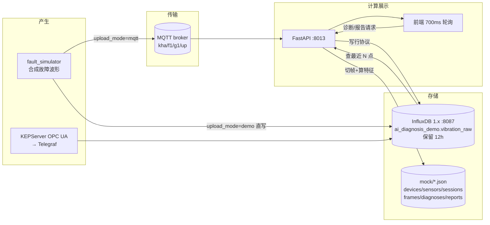
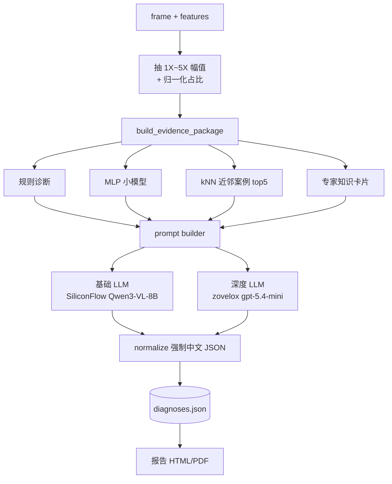

# AI 振动诊断平台 v4 —— 数据流分析与整合预研

- 编写日期：2026-08-12
- 分析对象：`root@10.126.126.11:/root/ruiteng/2026/ai_diagnosis/v4`（在用的"AI 设备运维在线振动诊断平台"）
- 分析方式：现场读代码 + 实测运行态（进程 / 端口 / InfluxDB 实际数据），**非纸面推测**
- 目的：为把该平台与 daqgate / historystore（以及 daqvision 的 AI 侧工程）整合做前期摸底

> 说明：本文放在 daqvision/doc 下是按要求归档。严格讲 v4 属于"AI 振动诊断"而非"AI 视觉"，
> 若后续 daqvision 定位为 AI 能力统一工程，可保留此处；否则建议另立 `daqai/` 或移入 daqgate/docs。

---

## 0. 一句话结论

**v4 是一个自采、自存、自算、自展的闭环单体**：它自己造数据、自己写 InfluxDB、自己从
InfluxDB 回读切帧、自己算特征、自己调大模型、自己出报告。整合的关键不在"接口对齐"，
而在**把数据面（采集 + 存储）从 v4 手里拿走交给 daqgate/historystore，只给它留"分析面"**。
两边的数据模型有一处硬冲突（tag 语义 vs globalId 数字 measurement）和一处硬缺口（无 VQT 的 Q 与真实 T），
这两点决定了整合的工作量，必须先定契约再动代码。

---

## 1. 运行态实测（2026-08-12 15:40 采集）

### 1.1 进程与端口

| 组件 | 实测状态 |
|---|---|
| 后端 FastAPI | `uvicorn app:app --host 127.0.0.1 --port **8013**`（PID 1411051，8月11 起跑，累计 CPU 117 分钟） |
| 前端 Vite dev | `vite --host 127.0.0.1 --port **5173**`（PID 1404360，dev 模式，非 dist） |
| InfluxDB 1.x | 同机 `influxd`，**:8087**（另有 :8088 RPC）——v4 的时序库 |
| MQTT Broker :1883 | **未监听**（当前链路没走 MQTT，见 §3.2） |
| historystored :8086 | 同机运行（我方项目），与 v4 **当前无任何关系** |

后端自报健康：

```json
{"status":"ok","data_source":"mqtt_sim","gpt_configured":true,
 "influx":{"host":"192.168.1.135","port":8087,"db":"ai_diagnosis_demo",
           "measurement":"vibration_raw","schema":"tags"}}
```

注：`192.168.1.135` 就是本机 ens160 地址，即 v4 通过 LAN IP 回环访问同机 InfluxDB。

⚠️ 一处待现场确认：`frontend/.env` 里 `VITE_API_BASE_URL=http://127.0.0.1:8005/api`，
而后端实际监听 8013；`start_app.sh` 默认又是 8005。dist 产物里烤进去的是 8005/8006。
当前跑的是 dev 模式，端口对不上会直接 404 —— 可能有未提交的本地覆盖（`.env.local` 之类）或
浏览器侧改过。**整合前需确认现网前端到底连哪个口**。

### 1.2 时序库真实数据量（这是整合最重要的一组数字）

```
db=ai_diagnosis_demo  measurement=vibration_raw
点数        123,663,378
series 数   3（acc5 的 x/y/z 三条）
保留策略    autogen  duration=12h  shardGroupDuration=1h
最新点      2026-08-12T07:40:37.149695461Z（= 北京时间 15:40，正在写）
当前会话    session_id=sess_8f9cb4eed0，帧序号已到 167967
```

**换算：1 个传感器 × 3 轴 × 1000 Hz = 3000 点/秒**，一行行协议一个点。
123.6M 点 ÷ 3000 ≈ 11.4 小时，正好卡在 12h 保留窗口 —— 说明这套链路**7×24 满速在写**，
靠 12 小时保留策略自我了断。这就是整合的核心动因：
**一个测点就吃掉 3 kpts/s 和一整个 InfluxDB，车队规模下完全不可持续。**

另有 `db=irtdb` 存在于同一个 InfluxDB 实例（measurement 名也叫 `irtdb`），
代码里 `INFLUX_SCHEMA=legacy_irtdb` 分支即为对接它而留。

---

## 2. 系统构成

```
v4/
  backend/                     FastAPI 单体（app.py 2254 行，全部路由都在一个文件）
    config/settings.py         全部配置（读 backend/.env）
    services/
      realtime_bridge.py  ★    InfluxDB 客户端 + MQTT 订阅者 + 两个模拟发布器
      mock_db.py          ★    "关系库"=6 个 JSON 文件
      signal_processing.py★    FFT / 包络谱 / 时域特征 / 阶次 / 健康分
      servo_store.py           伺服域链路（另一套 store）
      robot_arm_store.py       机械臂域链路
      press_store.py           压力机域链路
      mini_demo_store.py       迷你演示
      order_sample_demo_store.py  阶次样本演示
      gpt_client.py            零样本诊断 / 谱图分析（图+文多模态）
      report_service.py        HTML/PDF 报告
      fault_simulator.py       故障波形合成
      servo_simulator.py / press_simulator.py
    order_diagnosis/           阶次谱诊断（规则 / MLP / kNN / 专家知识 / LLM prompt）
    servo_diagnosis/           决策树 + CNN-LSTM
    press_diagnosis/           SVM 等
    tools/                     本地 MQTT broker、OPC UA 同步、评估脚本
  frontend/                    原生 JS + Vite（main.js 单文件 5590 行）+ LightningChart JS
  .venv/                       1.5G（含 torch）
```

全仓 ~18.6k 行有效代码，**没有单元测试目录**，没有 CI。

**四个并行的业务域**，每个域一套独立的 store/表/接口，互不复用：

| 域 | 采样率 | measurement | 诊断模型 |
|---|---|---|---|
| vibration（振动，主线） | 1000 Hz（默认配 25000） | `vibration_raw` | 规则 / MLP / kNN / LLM / 模板预警 |
| servo（伺服） | 10 Hz，9 路信号 | `servo_raw` | 决策树 / CNN-LSTM |
| robot_arm（机械臂） | 10 Hz | 同上模式 | 决策树 |
| press（压力机） | 50 Hz | 同上模式 | SVM |

---

## 3. 振动主链路：完整数据流

### 3.1 全景



### 3.2 三种数据来源（由 sensor 的 `upload_mode` 决定）

| 模式 | 路径 | 代码 |
|---|---|---|
| `demo`（**当前在跑**） | 合成波形 → **直写** InfluxDB | `DirectInfluxPublisher` |
| `mqtt` | 合成波形 → MQTT publish → 自己订阅 → 写 InfluxDB | `SimulatedMqttPublisher` + `MqttInfluxSubscriber` |
| 真实 OPC UA | KEPServer → Telegraf → InfluxDB，再跑同步脚本补 frame 索引 | `tools/sync_opcua_influx_frames.py` |

判定"当前在跑 demo 模式"的依据：1883 端口无监听，但 InfluxDB 仍在以 3000 点/秒增长。

MQTT payload 格式（对接现场网关时的既有约定，来自甲方）：

```json
{"params":{"dir":"up","iid":"sess_xxx-0","sample_rate":1000,
  "batch_start_ns":1780000000000000000,
  "r_data":[{"name":"kha_f1_g1_acc1_ax","value":"0.012345","err":"0"}]}}
```

NodeId 命名法 `{客户}_{厂区}_{网关}_{传感器}_{通道}`：`kha_f1_g1_acc1_ax`，
后缀表按 `SUFFIX_MAP` 展开为 (轴, 物理量)：`ax/ay/az`=加速度、`vx..`=速度、`dx..`=位移、
`hzx..`=频率、`temp`=温度、还有 `samplefreq`/`cutofffreq*`/`modbusmodel` 等配置类点。

### 3.3 写入侧：payload → 行协议

`mqtt_payload_to_lines()`（realtime_bridge.py:112）逐点展开：

```
vibration_raw,axis=x,device_id=kha_f1_g1,metric=acceleration,
  node_id=kha_f1_g1_acc1_ax,sensor_id=acc1,session_id=sess_xxx,
  source_prefix=kha_f1_g1_acc1
  value=0.012345,err=0i,iid="sess_xxx-0"
  1780000000000000000
```

**时间戳生成方式（关键缺陷）**：

```python
sample_interval_ns = 1e9 / sample_rate
ts = batch_start_ns + sample_index * sample_interval_ns
```

即**每个样本的时间是按批起始时间 + 序号推算出来的，不是真实采样时刻**。
批与批之间用 wall clock 重新对齐（`time.time_ns()`），所以帧边界会有累积抖动/重叠，
且没有任何字段记录"这是推算值"。

**质量码缺失**：只有 `err` 字段（0/非 0），无 OPC UA Quality、无 VQT 语义。
`field_value()` 遇到 NaN/Inf 直接写 `0.0` —— **坏值被静默伪装成合法的 0**。

### 3.4 读取侧：InfluxDB → frame

前端每 700 ms 打一次 `GET /api/sensors/{id}/latest-frame`，后端每次都：

1. `query_latest_channel_points()` → 对**每个通道各发一条** InfluxQL：
   `SELECT value FROM vibration_raw WHERE sensor_id=.. AND axis=.. AND metric=.. AND node_id=.. AND session_id=.. ORDER BY time DESC LIMIT N`
2. N = `sample_rate × REALTIME_DISPLAY_WINDOW_SEC` = 1000 × 0.5 = **500 点/通道**
3. 三通道点数不齐 → 取 min；不够 N 点 → 返回 None（前端等下一轮）
4. 够了就 `db.append_frame()`：算三通道特征、判 normal/warning/alarm、写进 `frames.json`
5. `_payload_frame()` 组装响应：波形（抽稀到 ≤1200 点）+ FFT + 包络谱 + 能量汇总 +
   阶次 + **最近 18 帧的瀑布图**（每帧都重算一次 FFT）+ 最近 36 帧散点/趋势

**注意第 5 步的代价**：一次 latest-frame 请求要重算 18 次 FFT，700ms 一轮。
这是后端 CPU 累计 117 分钟的主因。

### 3.5 帧与波形的持久化

- `WAVEFORM_PERSISTENCE=0`：**波形不落盘**。`waveform_path` 恒为空串。
- 波形只存在于 `MockDB._waveform_cache`（进程内存 dict，**永不淘汰**，按 frame_id 累积）
- 进程重启后回溯历史帧 → 走 `load_waveform()` 的兜底：按 `data_start_time..data_end_time`
  **回查 InfluxDB** 重建波形 → 一旦超过 **12h 保留窗口，历史帧就永久变成空壳**（有特征无波形）

---

## 4. 数据模型

### 4.1 时序层（InfluxDB，tags schema）

| 类别 | 字段 |
|---|---|
| tags | `device_id` `sensor_id` `source_prefix` `axis` `metric` `node_id` `session_id` |
| fields | `value`(float) `err`(int) `iid`(string) |
| time | 推算值（见 §3.3） |

⚠️ **高基数隐患**：`session_id` 是 tag，每次点"开始采集"就产生一个新 session_id，
series 数 = 传感器数 × 3 轴 × 历史 session 数，**无上界**。当前只有 3 条 series 是因为
12h 保留把老 session 一起淘汰了 —— 换成长保留会立刻爆炸。
另外 `iid` 作为 field 每点都存一份字符串，纯浪费。

`legacy_irtdb` schema 分支则改用单字段 `NodeId` 查询，用于对接既有 iRTDB 库。

### 4.2 业务层（`backend/data/mock/*.json`）

| 文件 | 内容 |
|---|---|
| devices.json | 厂区/车间/设备/额定转速/健康分 |
| sensors.json | 通道、`node_map`(轴→NodeId)、`source_prefix`、采集开关、阈值 |
| sessions.json | 采集会话：起止、采样率、转速、故障模式、帧数 |
| frames.json | **帧索引 + 全部特征 + 分通道特征** |
| diagnoses.json | 每次诊断的完整输入输出（含证据包） |
| reports.json | 报告记录 |

**这是整合时必须替换的部分**，原因是实现方式：

```python
def _write(self, name, data):        # 每次写都是整个数组重新序列化
    self._atomic_write(self.files[name], data)

def append_frame(...):
    frames = self._read("frames")    # 读全量
    frames.append(frame)
    self._write("frames", frames)    # 写全量
```

即**每 0.5 秒追加一帧就要把整个 frames.json 反序列化 + 重新序列化一遍**，O(n²)。
文件里还带 JSON 损坏自愈逻辑（`_repair_json_array`）—— 说明现场真的写坏过。
`data/` 目录当前 229 MB，大部分是这些 JSON 和产物。

### 4.3 frame 结构（前后端契约核心）

```
frame_id / session_id / sensor_id / timestamp
data_start_time / data_end_time / start_sample / end_sample / duration_sec
channels[] / data_source / status(normal|warning|alarm) / fault_mode
features{}              主通道特征
features_by_channel{}   每通道一份
```

特征集（`compute_frame_features`）：
时域 `rms/peak/peak_to_peak/kurtosis/crest_factor/mean/std`、
`dominant_freq`、阶次 `amp_1x..amp_5x`、
频带能量 `low/mid/high_band_energy` + `spectral_centroid`、
投影 `feature_projection_1/2`、`health_score`（100 减各项罚分）、`fault_score`。

---

## 5. 诊断与报告链路



要点：

- **证据包（evidence package）是设计亮点**：LLM 不是直接看原始波形，而是拿到
  "规则结论 + 小模型结论 + 5 个近邻案例 + 专家知识卡"的结构化证据，prompt 强制只输出 JSON、
  候选标签闭集（正常/不平衡/不对中/轴承故障/机械松动）。这套做法可以直接移植到别的域。
- **另一条多模态路径**：`zero-shot` 与 `llm-spectrum-analysis` 会先用 matplotlib 把频谱
  **画成 PNG**，再把图片喂给多模态大模型。
- **LLM 失败一律本地降级**（`local_zero_shot` / `local_spectrum_analysis`），
  结果里打 `model_label="本地规则回退"` + `notice`。降级可见，这点做得对。
- 模板预警：拿历史帧当模板算特征向量（谱/包络/增强三组），欧氏或余弦距离，
  阈值 = 训练集互距 95 分位 × 系数。

**外部依赖与安全**：两个 LLM 端点在公网（`www.zovelox.com`、`api.siliconflow.cn`），
API Key 明文在 `backend/.env`。后端 `CORSMiddleware(allow_origins=["*"], allow_credentials=True)`，
**全部 API 无任何鉴权**。目前靠只绑 127.0.0.1 兜着。

---

## 6. 与 daqgate / historystore 整合预研

### 6.1 能力映射

| v4 现在自己做的 | 我方已有的对应件 | 结论 |
|---|---|---|
| 采集（模拟/OPC UA/MQTT） | daqgate 各 channel | **应下沉给 daqgate** |
| 点值时序存储（InfluxDB 12h） | historystore（10GB 滚动、WAL、压实） | **应下沉给 historystore** |
| 设备/测点台账（JSON 文件） | daqgate 实体配置 + EntityConfig 契约 | **应下沉给 daqgate** |
| 采集会话 / 帧索引 | 无对应 —— **v4 独有概念** | 需新增或留在 v4 |
| 波形帧存储 | 无对应（historystore 是标量点值库） | **契约缺口，见 6.3** |
| FFT/包络/特征计算 | 无 | 留在 v4 |
| 规则/小模型/kNN/LLM 诊断 | 无 | 留在 v4，可服务化 |
| 报告 | 无 | 留在 v4 |

### 6.2 三处硬冲突（必须先解决再谈代码）

**① measurement 语义完全不同 —— 这是最大的一处**

historystored 的 InfluxDB v1 兼容口（:8086）实测返回：

```
measurement names are historystore RAW storage ids (globalId); this endpoint does NOT apply
the (guid,localId)->globalId mapping. They are NOT gateway local tag ids: use the gRPC
QueryHistory path (via daqgate) for point history.
```

即 historystore 的 measurement 是**数字 globalId**（"2","3",..."385"），
而 v4 的每一条查询都建立在 **tag 语义**上（`WHERE sensor_id=.. AND axis=.. AND metric=.. AND node_id=..`）。

**把 `INFLUX_HOST/PORT` 一改就能切过去" 是错的，切过去一条查询都跑不通。** 必须有映射层：

- 方案 a：v4 侧加适配器，把 `(sensor_id, axis, metric)` → `globalId`，查询改按 measurement 走
- 方案 b：daqgate 提供语义查询代理（gRPC QueryHistory + 标签检索），v4 改调 gRPC
- **倾向 b**：与既有契约一致，不让 v4 依赖 historystore 内部 id 空间；
  且多网关共库时 `(guid, localId) → globalId` 的映射本来就归 daqgate 侧解释。

**② VQT 缺 Q 和真 T**

我方铁律是 V+Q+T 三元组缺一不可；v4 现状：

- V：有
- Q：**没有**。只有 err 0/1；NaN/Inf 被静默改写成 0.0，坏值与真实 0 不可区分
- T：**是推算的**（batch_start + index/fs），不是真实采样时刻

整合时必须在采集侧（daqgate）补齐：真实采样时刻 + 真实质量码，
并明确"高频波形逐点是否都要独立时间戳"（见下）。

**③ 波形 ≠ 点值**

historystore 是标量点值时序库。振动的本质是**波形帧**：25 kHz × 3 轴，一帧 0.5 s = 37500 个样本。
把它当 37500 个独立 VQT 点存，索引/WAL/压实的开销荒谬。建议分层：

| 层 | 内容 | 存哪 | 频度 |
|---|---|---|---|
| 特征层 | rms/peak/kurtosis/1X~5X/health_score… | historystore 正常测点（完整 VQT） | 每帧一次，~2 Hz |
| 波形层 | 原始帧（二进制块 + 元数据） | **待定**：对象存储 / 专用 blob 段 / 只留最近 N 帧 | 按需 |
| 结论层 | 诊断结果、报警 | 关系库 / historystore 事件 | 事件驱动 |

**这一条是本次预研最需要 daqgate 侧表态的**：historystore 要不要长一个"波形/数据块"能力，
还是波形彻底不进时序库、由 v4 自管。两条路的架构差别很大。

### 6.3 整合路线建议（分三阶段）

**阶段 1 — 数据面下沉（收益最大、风险最低）**

- daqgate 负责采集（OPC UA/Modbus/MQTT 都已有通道），写 historystore
- v4 停用 `DirectInfluxPublisher` / `SimulatedMqttPublisher` / `MqttInfluxSubscriber`
- v4 的读取路径从"直连 InfluxDB"改为"经 daqgate 查询"（gRPC 或语义 HTTP 代理）
- 台账（devices/sensors）改由 daqgate EntityConfig 下发，v4 只读
- **验收标准**：v4 页面功能不变，`ai_diagnosis_demo` 库可以停写

**阶段 2 — 分析面服务化（对齐 daqvision 的 vision.proto 模式）**

- 把 v4 的诊断能力抽成 gRPC 服务：`DiagnoseFrame(frame) → DiagnosisResult`
- 参照 `daqvision/proto/vision.proto` 的形态：**Python 服务当 Server，daqgate(Go) 当 Client**，
  实现为 daqgate 的 `channel/diagnosis` 通道
- 诊断结论（health_score / 故障类型 / 置信度）作为**虚拟测点**回流 historystore，
  从此可以做趋势、报警、上云 —— 这是整合真正的价值点
- 复用现成的证据包 + 闭集 prompt 设计，不重写

**阶段 3 — 前端归一**

- v4 的图表能力（LightningChart 波形/频谱/瀑布）以页面或组件形式并入统一 Web
- 报告服务保留

**明确不建议做的**：只把 v4 的页面挂进统一菜单（"UI 整合"）。那样数据面依然各写各的，
3 kpts/s 的问题一点没解决，只是把两个系统的债捆在一起。

### 6.4 整合前必须改掉的 v4 现存问题

| # | 问题 | 影响 | 建议 |
|---|---|---|---|
| 1 | `frames.json` 全量读写 | O(n²)，已出现过文件损坏 | 换 SQLite/PG（v4 自己的文档 §14 也这么建议） |
| 2 | `session_id` 当 tag | series 无上界 | 降为 field，或整合后由 daqgate 语义层承担 |
| 3 | `_waveform_cache` 无淘汰 | 长跑内存只增不减 | LRU + 上限 |
| 4 | 12h 保留 + 波形不落盘 | **超过 12h 的历史帧永久变空壳** | 整合后由 historystore 承担长期留存 |
| 5 | 无鉴权 + CORS `*` | 一旦不绑 127.0.0.1 即裸奔 | 整合进统一网关鉴权 |
| 6 | API Key 明文在 .env | 泄露风险 | 移入统一密钥管理 |
| 7 | NaN/Inf → 0.0 | 坏值伪装成正常值 | 按 VQT 铁律给质量码 |
| 8 | 每次 latest-frame 重算 18 次 FFT | CPU 常态占用 | 帧特征/频谱结果缓存 |
| 9 | 无测试 | 改不动 | 整合前至少补住信号处理与 frame 切分的回归 |

### 6.5 待 daqgate / 业务侧确认的问题

1. **波形要不要进 historystore？**（§6.2 ③）—— 决定架构，优先级最高
2. 语义查询走 gRPC QueryHistory 代理，还是 v4 自持 globalId 映射表？
3. v4 的"采集会话（session）"概念是否要提升为平台级概念（daqgate 是否感知）？
4. 真实现场的振动数据源是哪条？OPC UA(KEPServer) / MQTT / 厂商网关直连 —— 决定 daqgate 用哪个 channel
5. 采样率现场到底是多少？代码默认 25000，.env 现配 1000，两者差 25 倍，容量测算完全不同
6. 伺服/机械臂/压力机三个域是否一并整合，还是先只做振动？
7. LLM 调用是否允许出公网？现场部署（矿山/工厂）大概率不允许，需要本地模型方案

---

## 7. 附：关键文件索引

| 关注点 | 文件 |
|---|---|
| 全部 HTTP 路由 | `backend/app.py` |
| InfluxDB 读写 / MQTT / 模拟发布 | `backend/services/realtime_bridge.py` |
| 配置项全集 | `backend/config/settings.py` + `backend/.env` |
| "关系库" | `backend/services/mock_db.py` |
| 信号处理与特征 | `backend/services/signal_processing.py` |
| 证据包与 prompt | `backend/order_diagnosis/{evidence_builder,llm_prompt_builder}.py` |
| OPC UA 联调步骤（现成的） | `docs/opcua-telegraf-influx-platform-sync.md` |
| MQTT/InfluxDB 链路说明（作者自述） | `DEMO_MQTT_INFLUXDB_LINK.md` |
| 启动脚本 | `start_app.sh` |
